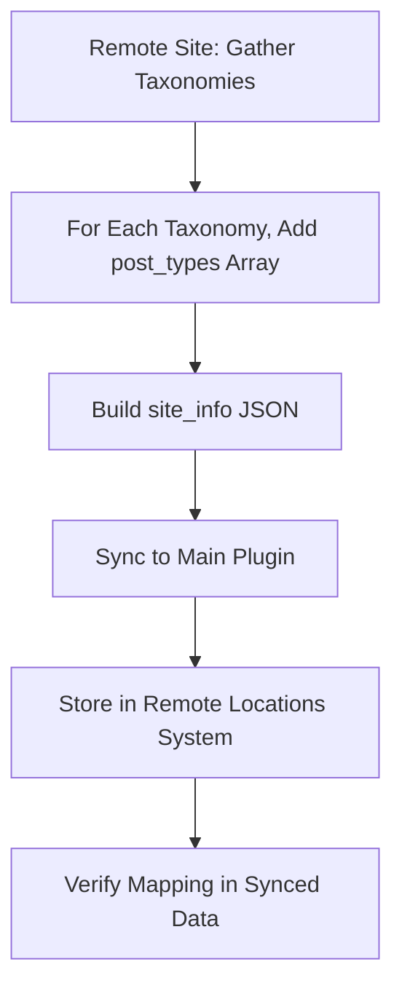

# Custom Taxonomy Support Plan

## Overview

This document outlines the plan for robust, dynamic support of custom and nonstandard taxonomies in the Data Machine remote publishing system. The goal is to ensure that all taxonomies—standard, nonstandard, and custom—are correctly synced, surfaced in the UI, and assigned to posts in a modular, backward-compatible way.

---

## Goals

- Sync all taxonomies and their terms, including a mapping of which post types each taxonomy is registered for.
- Dynamically present available taxonomies in the settings and publishing UI based on the selected post type.
- Ensure the publish payload includes correct term assignments for all relevant taxonomies.
- Update the remote endpoint to assign terms for all taxonomies registered for the post type.
- Maintain backward compatibility and minimize risk to existing flows.

---

## Step 1: Update Sync Logic (Foundation)

**Objective:**  
Sync all taxonomies, their terms, and the mapping of taxonomies to post types.

**Actions:**
- Update the airdrop helper's `/site-info` endpoint to include, for each taxonomy, a `post_types` (or `object_type`) array listing all post types the taxonomy is registered for.
- Update the main plugin's sync logic to consume and store this mapping in the remote locations system.
- Verify that the synced site info JSON contains, for each taxonomy, a `post_types` or `object_type` array with the correct post type slugs.

**Mermaid Diagram:**

---

## Step 2: Dynamic Settings & UI

**Objective:**  
Present only the taxonomies available for the selected post type in the settings and publishing UI.

**Actions:**
- Update the settings logic (admin/class-data-machine-settings-fields.php) to dynamically display taxonomy options based on the selected post type, using the synced mapping.
- Update any relevant JavaScript to support dynamic taxonomy selection.
- Ensure the UI is clean, modular, and backward-compatible.

---

## Step 3: Payload Construction

**Objective:**  
Include correct term assignments for all relevant taxonomies in the publish payload.

**Actions:**
- Update the output handler (includes/output/class-data-machine-output-publish_remote.php) to build the payload with selected terms for all taxonomies registered for the chosen post type.
- Ensure the payload structure is extensible and backward-compatible.

---

## Step 4: Remote Endpoint Logic

**Objective:**  
Assign terms for all taxonomies registered for the post type on the remote site.

**Actions:**
- Update the airdrop helper's post creation endpoint to:
  - Loop through all taxonomies present in the payload (excluding 'category' and 'post_tag' to avoid double-assignment).
  - For each taxonomy, check if it is registered for the post type.
  - Assign the provided terms using `wp_set_post_terms()`.

- Retain the current logic for 'category' and 'post_tag' for backward compatibility.

---

## Step 5: Testing & Verification

**Objective:**  
Ensure robust, error-free operation and backward compatibility.

**Actions:**
- Test with a variety of post types and taxonomies (standard, nonstandard, custom).
- Verify that only valid taxonomies are shown and assigned for each post type.
- Confirm that legacy flows for 'category' and 'post_tag' remain functional.

---

## Notes

- All changes should be modular and well-documented.
- Consider adding a feature flag for the new dynamic taxonomy logic for easy enable/disable.
- This plan is a living document and should be updated as implementation progresses or requirements evolve.

---

## Future Updates

- [ ] Document any edge cases or limitations discovered during implementation.
- [ ] Add additional diagrams or code snippets as needed.
- [ ] Update with feedback from live testing.